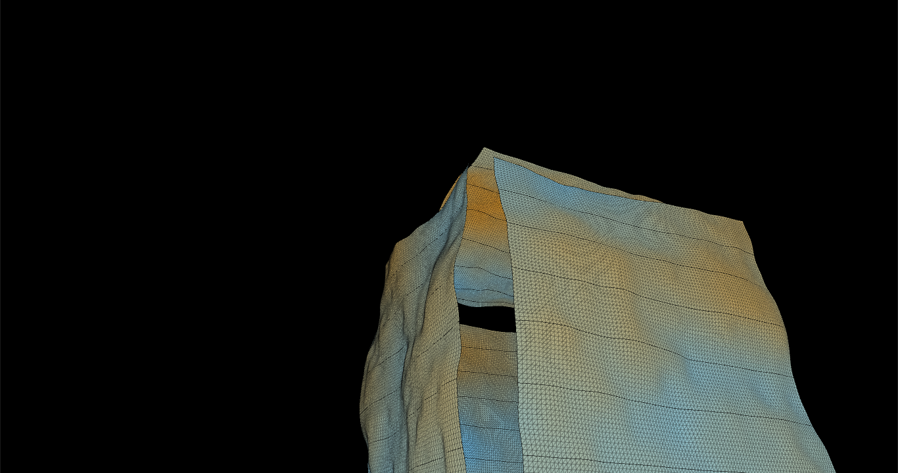

# Sound responsive 3D-Terrain
I aimed to find a way to visualize sound in another structure than I'm used to. 
So I built a cube made up of 6 responsive planes that each generates their topography 
based on the level of amplification of the sound that is played. 

I made it in processing. 

––––––––––––––––––––––––––––––––––––––––––––––––––––––––––

––––––––––––––––––––––––––––––––––––––––––––––––––––––––––

This is a link to the video preview: https://vimeo.com/381885743  

Based of and inspired by coding trains 3D terrain generation project: https://youtube.com/watch?v=IKB1hWWedMk
